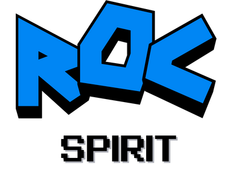

<samp>

# ROC Spirit

ROC Spirit is a 1st-place DandyHacks augmented-reality campus tour app with 3D characters, map-based exploration, quests, and a themed mobile experience. It brings University of Rochester storytelling into an interactive Expo and React Native app.

Built with <strong>Expo, React Native, ViroReact, Supabase, Zustand, 3D models, video assets, and custom quest content</strong>.

## Highlights

<ul>
  <li>AR poster scenes connect campus markers to animated 3D characters and videos.</li>
  <li>Quest-stop configuration and game state support a guided campus-tour flow.</li>
  <li>Includes custom character models, branded artwork, maps, and themed UI assets.</li>
  <li>Uses Supabase and secure storage hooks for app data foundations.</li>
</ul>

## Tech Stack

<table>
  <tr><th>Layer</th><th>Tools</th></tr>
  <tr><td>Core stack</td><td>TypeScript, Expo, React Native, ViroReact</td></tr>
  <tr><td>Supporting tools</td><td>Supabase, Zustand, React Navigation, 3D GLB assets</td></tr>
</table>

## Quick Start

<pre><code>npm install
npm start
npm run ios
npm run android</code></pre>

## Project Structure

<pre>app/ - Expo Router screens, AR scenes, and quest configuration
components/ - Camera, model, header, and shared UI components
assets/ - Images, videos, marker art, and 3D models
lib/ - Supabase, Vapi, colors, and helpers
hooks/ - Camera permission and theme hooks</pre>

## Validation

Run <code>npm run lint</code> and test on a device/simulator for AR behavior.

## Scope Notes

AR features depend on device capabilities, camera permission, and native runtime support; web mode will not represent the full experience.

## Roadmap

<ul>
  <li>Document Supabase environment variables and schema assumptions.</li>
  <li>Add demo screenshots or a short tour GIF.</li>
  <li>Add setup notes for testing AR markers.</li>
</ul>

## License

No license file is currently included.

## Built By

Built by <strong>Abigail Briones Aranda</strong> as part of a growing AI/software engineering portfolio focused on readable systems, thoughtful interfaces, and reproducible project documentation.

</samp>
